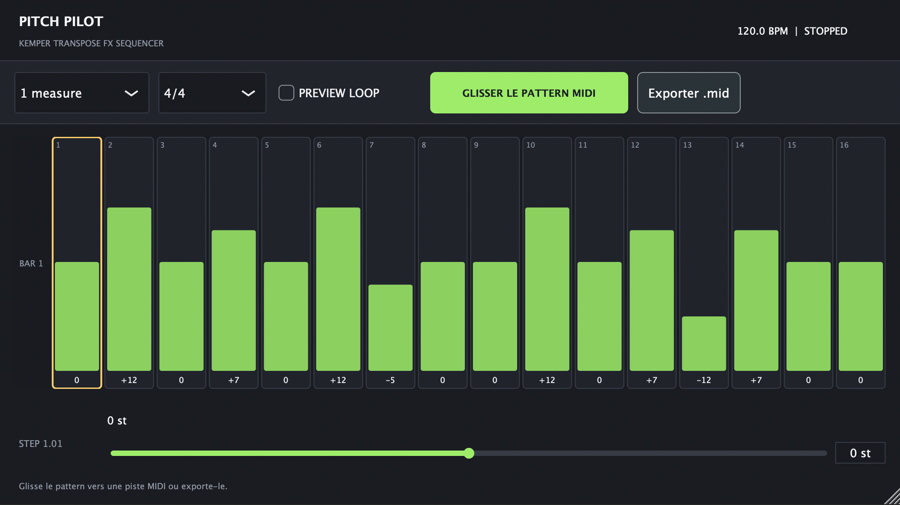
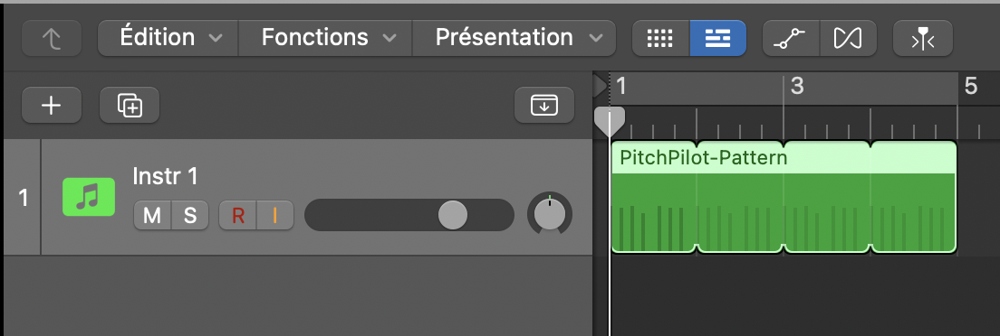

# PitchPilot

**PitchPilot** is a tempo-synced MIDI step sequencer for the **Kemper Profiler Player**. Draw a pitch phrase, export it as a MIDI clip, and place different phrases on your DAW timeline.

It is designed for **Logic Pro (AU MIDI FX)** and **Ableton Live (VST3)** on macOS. PitchPilot controls **Voice 1 Pitch** of a **Transpose** effect loaded in **slot B** of the current Kemper Rig. It sends MIDI; it does not process guitar audio.

## Screenshots

**Pattern editor** — set a pitch for each sixteenth-note step and export the result as MIDI.

**Logic Pro arrangement** — repeat and arrange exported MIDI regions on the timeline.

Compiled downloads will be added later.

## Features

- 1 to 4 bars in **4/4** (16 sixteenth-note steps per bar) or **6/8** (12 steps per bar)
- **Auto / 4/4 / 6/8** time-signature setting: follow the DAW or select it manually
- Individual pitch values from -24 to +24 semitones
- Drag a pattern to the arrangement, or export a `.mid` file
- Create, move, and copy independent MIDI regions to build a song
- Optional tempo-synced **Preview Loop**, off by default
- Discrete step values without pitch-pedal glide
- Project state saved by the DAW

PitchPilot sends Kemper NRPN page **51**, parameter **56**, on MIDI channel **16**. Each exported clip selects the parameter at its start, sends new values only when the pitch changes, then resets the pitch to zero near its end.

## Requirements

- macOS 11 or newer
- Logic Pro or Ableton Live with VST3 support
- Kemper Profiler Player connected as a MIDI destination
- A **Transpose** effect in **slot B** of the current Rig

## Logic Pro

1. Create a **Software Instrument** track.
2. Insert **Pitch Pilot** in the **MIDI FX** slot.
3. Insert Logic's **External Instrument** in the Instrument slot.
4. Select the Kemper Player as MIDI destination, channel **16**. Choose the Kemper audio return if required.
5. Draw a phrase in PitchPilot and drag **GLISSER LE PATTERN MIDI** into the arrangement. If the host blocks the drag, use **Exporter .mid** and import the file.
6. Leave **Preview Loop off** while playing exported MIDI regions, so the preview and regions do not compete.

## Ableton Live

To arrange exported patterns, import the MIDI files on a single MIDI track with **MIDI To** set to the Kemper Player on channel **16**. The plugin does not need to stay on that playback track.

To audition the live preview, put PitchPilot VST3 on a first MIDI track. On a second MIDI track, select the first track and PitchPilot as **MIDI From**, set monitoring to **In**, and route **MIDI To** the Kemper Player.

## Working with patterns

Set a phrase of 1–4 bars, drag or export its MIDI file, then change the grid and export another phrase. Imported regions remain independent of later grid changes. The MIDI clips contain **controller events, not notes**. Begin playback at the start of a region so its NRPN selection is transmitted.

Start with a simple, low-volume test. The effect must already be loaded in slot B, and the MIDI track must reach the Kemper. **PitchPilot 0.7.0** supports 4/4 and 6/8 projects; the exported MIDI file includes the selected time signature. In Auto mode, use the manual 6/8 choice if the DAW does not report its signature while stopped.

## Download and source

Check [Releases](https://github.com/adriendoespostrock/pitchpilot/releases) for compiled macOS builds. The 6/8 feature requires version 0.7.0 or newer. The source code is not published in this repository at this stage.

## Credits

Created by **Adrien Deurveilher**. PitchPilot is an independent project and is not affiliated with Kemper GmbH.
